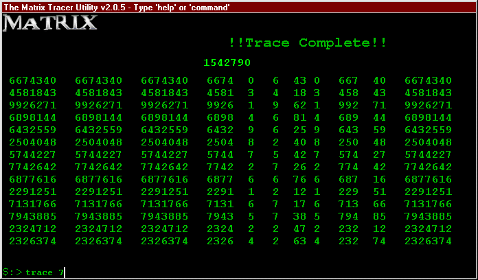



## Matrix Tracer \(Ramdom Number Generator\)

### Description

This is a re-done version of Nick Romanelli's Matrix Tracer code(http://pscode.com/xq/ASP/txtCodeId.21214/lngWId.1/qx/vb/scripts/ShowCode.htm).

I have left his origonal forms in there with the code untouched so you can see the big difference.

I have added a small command-line parsing function which controls the program.

Im sure there are better ways of doing this than I have, so please, any comments or suggestions are welcome. Again, the new code is all mine, but the concept was Nick Romanelli's.
 
### More Info
 

             |
---                |---
**Submitted On**   |2002-01-08 12:24:10
**By**             |[Xanth Nomeda](https://github.com/Planet-Source-Code/PSCIndex/blob/master/ByAuthor/xanth-nomeda.md)
**Level**          |Intermediate
**User Rating**    |5.0 (10 globes from 2 users)
**Compatibility**  |VB 6\.0
**Category**       |[Complete Applications](https://github.com/Planet-Source-Code/PSCIndex/blob/master/ByCategory/complete-applications__1-27.md)
**World**          |[Visual Basic](https://github.com/Planet-Source-Code/PSCIndex/blob/master/ByWorld/visual-basic.md)
**Archive File**   |[Matrix\_Tra47203182002\.zip](https://github.com/Planet-Source-Code/xanth-nomeda-matrix-tracer-ramdom-number-generator__1-30561/archive/master.zip)

